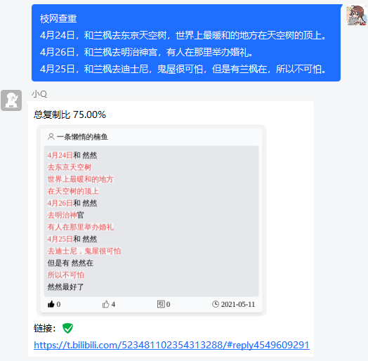

# nonebot-plugin-asoulcnki

NoneBot 枝网查重插件

利用 [枝网查重](https://asoulcnki.asia/) 查找最相似的小作文，为防止文字太长刷屏，将内容转换为图片形式发出

### 使用方式

- 查重/枝网查重 + 要查重的小作文

- 回复需要查重的内容，回复“查重”

- 小作文/随机小作文


### 安装

- 使用 nb-cli

```
nb plugin install nonebot_plugin_asoulcnki
```

- 使用 pip

```
pip install nonebot_plugin_asoulcnki
```


### 示例

<div align="left">
  
</div>


### 特别感谢

- [ASoulCnki/ASoulCnkiFrontEndV3](https://github.com/ASoulCnki/ASoulCnkiFrontEndV3) 参考了该项目的界面和查重代码

- [cscs181/QQ-GitHub-Bot](https://github.com/cscs181/QQ-GitHub-Bot) 参考了 playwright 的使用以及图片生成的方式

